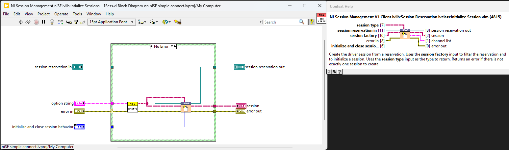
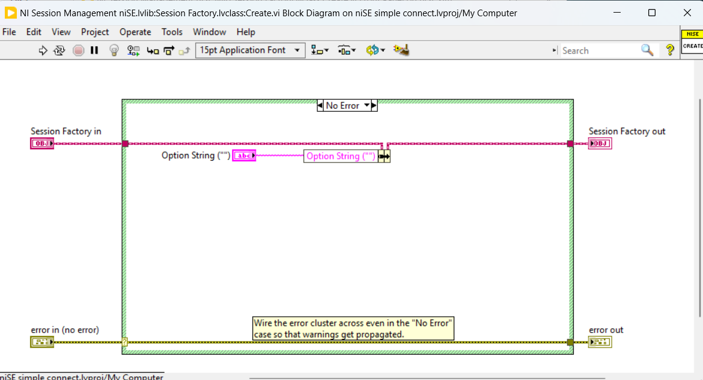

# gRPC DAQmx LabVIEW - Temporary Solution

- [gRPC DAQmx LabVIEW - Temporary Solution](#grpc-daqmx-labview---temporary-solution)
    - [Who](#who)
    - [Feature WorkItem](#feature-workitem)
    - [Problem Statement](#problem-statement)
    - [Proposed Solution](#proposed-solution)
    - [Key Requirements](#key-requirements)
    - [Requested NI DAQmx Functions and Property Nodes](#requested-ni-daqmx-functions-and-property-nodes)
    - [Workflow](#workflow)
        - [Vision](#vision)
        - [User Workflow](#user-workflow)
    - [Scope](#scope)
        - [NI DAQmx Client](#ni-daqmx-client)
        - [TestStand](#teststand)
        - [Examples](#examples)
        - [Deployment](#deployment)
    - [Design & Implementation](#design--implementation)
        - [Overview](#overview)
        - [Proto File for NI DAQmx Functions](#proto-file-for-ni-daqmx-functions)
        - [NI DAQmx gRPC Client Creation](#ni-daqmx-grpc-client-creation)
        - [Session Management Implementation in Client](#session-management-implementation-in-client)
        - [DAQmx LabVIEW Client Deployment](#daqmx-labview-client-deployment)

## Who

- Author: _National Instruments_
- Team: _Intelligent Validation_

## Feature WorkItem

[Feature: gRPC DAQmx LabVIEW - temporary solution](https://dev.azure.com/ni/DevCentral/_workitems/edit/3055103/)

## Problem Statement

NI gRPC device server supports session management and session reuse of NI DAQmx. Python Clients are available to access NI gRPC device server. But NI DAQmx cannot access (as of Apr 2025) NI gRPC device server in LabVIEW Measurement Plug-in due to absence of LabVIEW Client.

## Proposed Solution:

LabVIEW gRPC client will be created to access the NI GRPC device server for session reuse across LabVIEW Measurement Plug-ins and the clients will be integrated with Session Management APIs to enable session management.

## Key Requirements

1. **gRPC Client in LabVIEW:** Provide VIs for all gRPC server methods, ensuring connector pane matching and session management using class objects.
2. **TestStand:** Offer helper functions (VIs) for building automation sequences with the DAQmx gRPC driver.
3. **Examples:** Create LabVIEW and TestStand examples demonstrating DAQmx client usage and helper functions.
4. **Deployment:** Deploy the gRPC server and client VIs using NI and VI Packages, respectively.

## Requested NI DAQmx Functions and Property Nodes

| **NI DAQmx Functions & Property Nodes**                                   | **Inputs (Data Type)**                                                                                     | **Outputs (Data Type)**                                   |
|:--------------------------------------------------------------------------|:----------------------------------------------------------------------------------------------------------|:---------------------------------------------------------|
| **DAQmx Create Task.vi**                                                  | task to copy (DAQmx Task Resource), global virtual channels (DAQmx Global Channel Resource), new task name (String), auto cleanup (Bool) | task out (DAQmx Task Resource)                           |
| **DAQmx Create Channel (DO-Digital Output).vi**                           | task in (DAQmx Task Resource), lines (DAQmx Physical Channel Resource), name to assign (String), line grouping (Enum)                     | task out (DAQmx Task Resource)                           |
| **DAQmx Create Channel (CI-Frequency).vi**                                | task in (DAQmx Task Resource), counter (DAQmx Physical Channel Resource), name to assign (String), units (Enum), custom scale name (DAQmx Scale Resource), starting edge (Enum), measurement time (Double), maximum value (Double), minimum value (Double), measurement method (Enum), divisor (uint32) | task out (DAQmx Task Resource)                           |
| **DAQmx Write (Digital Bool 1Line 1Point).vi**                            | task/channels in (DAQmx Task Resource), data (Bool), timeout (Double), auto start (Bool)                                                   | task out (DAQmx Task Resource), number of samples written per channel (uint32) |
| **DAQmx Read (Counter DBL 1Chan 1Samp).vi**                               | task/channels in (DAQmx Task Resource), timeout (Double)                                                                                   | task out (DAQmx Task Resource), data (Double)            |
| **DAQmx Timing (Implicit).vi**                                            | task/channels in (DAQmx Task Resource), sample mode (Enum), samples per channel (int32)                                                    | task out (DAQmx Task Resource)                           |
| **DAQmx Start Task.vi**                                                   | task/channels in (DAQmx Task Resource)                                                                                                     | task out (DAQmx Task Resource)                           |
| **DAQmx Stop Task.vi**                                                    | task/channels in (DAQmx Task Resource)                                                                                                     | task out (DAQmx Task Resource)                           |
| **DAQmx Clear Task.vi**                                                   | task/channels in (DAQmx Task Resource)                                                                                                     | -                                                        |
| **DAQmx Task >> Name**                                                    | task/channels in (DAQmx Task Resource)                                                                                                     | task out (DAQmx Task Resource), Name (DAQmx Task Resource) |
| **DAQmx Channel >> Counter Input : Frequency : Input : Terminal**         | task/channels in (DAQmx Task Resource)                                                                                                     | task out (DAQmx Task Resource), CI.Freq.Term (NI Terminal Resource) |
| **DAQmx Channel >> Counter Input : Frequency : Measurement Specifications : High Frequency : Measurement Time** | task/channels in (DAQmx Task Resource)                                                                                                     | task out (DAQmx Task Resource), CI.Freq.Meas.Time (Double) |

## Workflow

<!--
    Attach the workflow diagram
-->

### Vision


### User Workflow


## Scope

This feature aims to provide a compatible/equivalent client to achieve the IS Pro compatible session management and session reuse by using the gRPC device server. Once implemented, the M-Plugin developers will be able to use DAQmx Client APIs with LabVIEW M-Plugins in IS and TS just like other natively supported instrumentation such as nidmm, nidcpower etc., from Measurement IO Palette.

### NI DAQmx Client

1. Generate an NI DAQmx gRPC client using the LabVIEW [gRPC Server Client-Code Generation tool](https://github.com/ni/grpc-labview/blob/master/labview%20source/Client%20Server%20Support%20New/gRPC%20Scripting%20Tools/Open%20gRPC%20Server-Client%20%5B2%5D%20-%20Code%20Generator.vi) for all implemented DAQmx methods.
2. Implement session management by overriding the `ISession Factory` interface. This ensures proper initialization and closure of each session with the required configuration parameters. 
3. Develop high-level wrappers that replicate the connector panes of the LabVIEW DAQmx driver to provide a user-friendly interface.
4. Organize the gRPC client VIs in a function palette equivalent to the native DAQmx driver.

### TestStand

1. Helper functions (VIs) to build automation sequences with DAQmx gRPC driver

### Examples

1. LabVIEW M-Plugin example demonstrating the DAQmx client usage
2. TestStand sequence example demonstrating the helper function usage and M-Plugins with DAQmx calls

## Design & Implementation

### Overview

<!-- Inset Preface/Overview for Design and Implementation -->
The gRPC Device server supports DAQmx functions; however, LabVIEW wrappers are not yet available. Below is a high-level workflow for creating a custom client interface to enable IS Pro-compatible session management and session reuse:

1. **Create proto file for the NI DAQmx functions**
    - A .proto file is used to define the structure of the data and the services for gRPC communication. For NI DAQmx functions, this file will describe the remote procedure calls (RPCs) and the data types (messages) needed to interact with the DAQmx API.
    - It acts as the contract between the client and gRPC device server, ensuring both sides understand the data and operations.
2. **Create Client Stubs for the NI DAQmx Functions**
    - The client provides an interface for users to call the DAQmx methods remotely.
    - This enables remote communication between the client and gRPC device server, allowing distributed systems to interact with the DAQmx API.
3. **Client-Side Session Management Implementation**  
    - After generating the gRPC client, implement session management by overriding the `ISession Factory` interface.  
    - This ensures proper initialization and closure of each session with the required configuration parameters.  
    - Develop high-level wrappers that replicate the connector panes of the LabVIEW DAQmx driver to provide a user-friendly interface.
4. **DAQmx LabVIEW Client Deployment**
    - A VI package that installs the DAQmx client methods in the target PC and adds the wrappers to the LabVIEW functions palette.

### Proto File for NI DAQmx Functions

1. The Proto file for NI DAQmx functions is available in the [ni/gRPC-device repository](https://github.com/ni/grpc-device/blob/main/generated/nidaqmx/nidaqmx.proto).
2.  The gRPC proto service definitions for the required NI DAQmx [functions](Images/DAQmx_Functions.png) and [property nodes](Images/DAQmx_Property_Nodes.png) are as follows:
```proto
syntax = "proto3";

option java_multiple_files = true;
option java_package = "com.ni.grpc.nidaqmx";
option java_outer_classname = "NiDAQmx";
option csharp_namespace = "NationalInstruments.Grpc.NiDAQmx";

package nidaqmx_grpc;

import "session.proto";
import "google/protobuf/timestamp.proto";

service NiDAQmx {
    rpc CreateTask(CreateTaskRequest) returns (CreateTaskResponse);
    rpc CreateDOChan(CreateDOChanRequest) returns (CreateDOChanResponse);
    rpc CreateCIFreqChan(CreateCIFreqChanRequest) returns (CreateCIFreqChanResponse);
    rpc WriteDigitalLines(WriteDigitalLinesRequest) returns (WriteDigitalLinesResponse);
    rpc ReadCounterScalarF64(ReadCounterScalarF64Request) returns (ReadCounterScalarF64Response);
    rpc CfgImplicitTiming(CfgImplicitTimingRequest) returns (CfgImplicitTimingResponse);
    rpc StartTask(StartTaskRequest) returns (StartTaskResponse);
    rpc StopTask(StopTaskRequest) returns (StopTaskResponse);
    rpc ClearTask(ClearTaskRequest) returns (ClearTaskResponse);
    rpc GetTaskAttributeString(GetTaskAttributeStringRequest) returns (GetTaskAttributeStringResponse);
    rpc GetChanAttributeString(GetChanAttributeStringRequest) returns (GetChanAttributeStringResponse);
    rpc GetChanAttributeDouble(GetChanAttributeDoubleRequest) returns (GetChanAttributeDoubleResponse);
    rpc SetChanAttributeString(SetChanAttributeStringRequest) returns (SetChanAttributeStringResponse);
    rpc SetChanAttributeDouble(SetChanAttributeDoubleRequest) returns (SetChanAttributeDoubleResponse);
}
```
> [!NOTE]
> The NI DAQmx proto file in the [ni/gRPC-device repository](https://github.com/ni/grpc-device/blob/main/generated/nidaqmx/nidaqmx.proto) is implemented in Python and supports the NI gRPC device server. These proto file methods are reused in LabVIEW to replicate the session management workflow.

### NI DAQmx gRPC Client Creation

1. Utilize the LabVIEW [gRPC Server Client-Code Generation tool](https://github.com/ni/grpc-labview/blob/master/labview%20source/Client%20Server%20Support%20New/gRPC%20Scripting%20Tools/Open%20gRPC%20Server-Client%20%5B2%5D%20-%20Code%20Generator.vi) with the NI DAQmx proto file to create a gRPC client template for the specified methods.

### Session Management Implementation in Client

| **Method Name**                     | **Inputs**                                                                                                                                                                                                 | **Outputs**                                                                                                           | **Details**                                                                                                                                                                                                                     |
|-------------------------------------|----------------------------------------------------------------------------------------------------------------------------------------------------------------------------------------------------------|-----------------------------------------------------------------------------------------------------------------------|---------------------------------------------------------------------------------------------------------------------------------------------------------------------------------------------------------------------------------|
| **Initialize MeasurementLink Session.vi** | - `session factory in` (class object) <br> - `initialize and close session behavior` (enum) <br> - `session initialization parameters` (cluster) <br> - `remote connection options` (cluster)            | - `session factory out` (class object) <br> - `session out` (refnum)                                                  | Use the `Create Client` and `Create Task` methods within this VI to create tasks on the server.                                                                                                                               |
| **Get Instrument Type ID.vi**         | - `session factory in` (class object)                                                                                                                                                                    | - `session factory out` (class object) <br> - `instrument type id` (string)                                           | Set the `instrument type id` output to a string constant with the value `NIDAQmx`.                                                                                                                                            |
| **Get Provided Interface and Service Class.vi** | - `session factory in` (class object)                                                                                                                                                                    | - `session factory out` (class object) <br> - `provided interface` (string) <br> - `service class` (string)           | Set the `provided interface` output to a string constant with the value `nidaqmx_grpc.NiDAQmx`. <br> Set the `service class` output to a string constant with the value `ni.measurementlink.v1.grpcdeviceserver`.               |
| **Close MeasurementLink Session.vi**  | - `session factory in` (class object) <br> - `initialize and close session behavior` (enum) <br> - `session in` (refnum) <br> - `remote connection options` (cluster)                                    | -                                                                                                                     | Use the `Clear Task` and `Destroy Client` methods within this VI to close tasks on the server.                                                                                                                                |

1. Develop wrappers for each of the requested DAQmx functions, ensuring that their input and output connector panes closely match the format of the corresponding native driver functions.
2. The replication of measurement plug-in session initialization wrapper for DAQmx `Initialize Session 1Sess.vi` and `Initialize Session NSess.vi` includes a `Create.vi` and the measurement plug-in `NI Session Management V1 Client.lvlib: Session Reservation.lvclass: Initialize Session(s).vim`. We need to develop the `Create.vi` to use it in the initialization wrapper.  



### DAQmx LabVIEW Client Deployment

