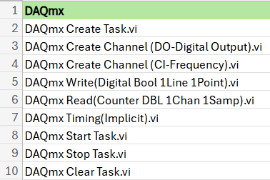
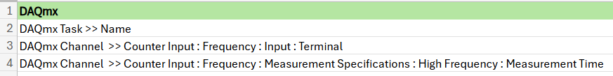

# gRPC DAQmx LabVIEW - Temporary Solution

- [gRPC DAQmx LabVIEW - Temporary Solution](#grpc-daqmx-labview---temporary-solution)
    - [Who](#who)
    - [Feature WorkItem](#feature-workitem)
    - [Problem Statement](#problem-statement)
        - [Key Requirements](#key-requirements)

## Who

- Author: _National Instruments_
- Team: _Intelligent Validation_

## Feature WorkItem

[Feature: gRPC DAQmx LabVIEW - temporary solution](https://dev.azure.com/ni/DevCentral/_workitems/edit/3055103/)

## Problem Statement

The NI DAQmx is not supported (as of Apr 2025) in terms of session management and reuse across LabVIEW Measurement Plug-in when used in InstrumentStudio or TestStand workflows. gRPC device server support is required to enable the workflows with IS Pro.

### Key Requirements

**gRPC Server:** Implement a gRPC server to support DAQmx functions and manage IS Pro session initialization behaviors.

**gRPC Client in LabVIEW:** Provide VIs for all gRPC server methods, ensuring connector pane matching and session management using class objects.

**TestStand:** Offer helper functions (VIs) for building automation sequences with the DAQmx gRPC driver.

**Examples:** Create LabVIEW and TestStand examples demonstrating DAQmx client usage and helper functions.

**Deployment:** Deploy the gRPC server and client VIs using NI and VI Packages, respectively.

## Scope

This feature aims to provide a compatible/equivalent workaround to achieve the IS Pro compatible session management and session reuse without extending the gRPC device server.Once implemented, the M-Plugin developers will be able to use DAQmx with LabVIEW M-Plugins in IS and TS just like other natively supported instrumentation such as nidmm, nidcpower etc.,

### NI DAQmx Server Generation

- Develop an NI DAQmx gRPC server using the [LabVIEW gRPC Server Client-Code Generation tool](https://github.com/ni/grpc-labview/blob/master/labview%20source/Client%20Server%20Support%20New/gRPC%20Scripting%20Tools/Open%20gRPC%20Server-Client%20%5B2%5D%20-%20Code%20Generator.vi).
- Implement the gRPC server to support the following NI DAQmx functions and property nodes:  
      
    
- Ensure support for all five initialization behaviors required for IS Pro session management:
    - Auto
    - Initialize and Close
    - Attach and Detach
    - Initialize and Detach
    - Attach and Close

### NI DAQmx Client Generation

- Generate an NI DAQmx gRPC client using the LabVIEW gRPC Server Client-Code Generation tool for all implemented DAQmx methods.
- Ensure the connector pane of the client VIs matches the equivalent DAQmx driver VIs.
- Use class objects to store gRPC session IDs, aligning with DAQmx session behavior.
- Organize the gRPC client VIs in a function palette equivalent to the native DAQmx driver.

## Design & Implementation

### Proto File for NI DAQmx Functions

- The Proto file for NI DAQmx functions is available in the [ni/gRPC-device repository](https://github.com/ni/grpc-device/blob/main/generated/nidaqmx/nidaqmx.proto).
- The gRPC proto service definitions for the required NI DAQmx [functions](Images/DAQmx_Functions.png) and [property nodes](Images/DAQmx_Property_Nodes.png) are as follows:
```proto
syntax = "proto3";

option java_multiple_files = true;
option java_package = "com.ni.grpc.nidaqmx";
option java_outer_classname = "NiDAQmx";
option csharp_namespace = "NationalInstruments.Grpc.NiDAQmx";

package nidaqmx_grpc;

import "session.proto";
import "google/protobuf/timestamp.proto";

service NiDAQmx {
    rpc CreateTask(CreateTaskRequest) returns (CreateTaskResponse);
    rpc CreateDOChan(CreateDOChanRequest) returns (CreateDOChanResponse);
    rpc CreateCIFreqChan(CreateCIFreqChanRequest) returns (CreateCIFreqChanResponse);
    rpc WriteDigitalLines(WriteDigitalLinesRequest) returns (WriteDigitalLinesResponse);
    rpc ReadCounterScalarF64(ReadCounterScalarF64Request) returns (ReadCounterScalarF64Response);
    rpc CfgImplicitTiming(CfgImplicitTimingRequest) returns (CfgImplicitTimingResponse);
    rpc StartTask(StartTaskRequest) returns (StartTaskResponse);
    rpc StopTask(StopTaskRequest) returns (StopTaskResponse);
    rpc ClearTask(ClearTaskRequest) returns (ClearTaskResponse);
    rpc GetTaskAttributeString(GetTaskAttributeStringRequest) returns (GetTaskAttributeStringResponse);
    rpc GetChanAttributeString(GetChanAttributeStringRequest) returns (GetChanAttributeStringResponse);
    rpc GetChanAttributeDouble(GetChanAttributeDoubleRequest) returns (GetChanAttributeDoubleResponse);
    rpc SetChanAttributeString(SetChanAttributeStringRequest) returns (SetChanAttributeStringResponse);
    rpc SetChanAttributeDouble(SetChanAttributeDoubleRequest) returns (SetChanAttributeDoubleResponse);
}
```
> [!NOTE]
> The NI DAQmx proto file in the [ni/gRPC-device repository](https://github.com/ni/grpc-device/blob/main/generated/nidaqmx/nidaqmx.proto) is implemented in Python and supports the NI gRPC device server. These proto file methods are reused in LabVIEW to replicate the session management workflow.

### NI DAQmx Server Implementation

- Use the LabVIEW gRPC Server Client-Code Generation tool with the NI DAQmx proto file as input to generate a gRPC server template for the defined methods.
- Develop LabVIEW wrappers for the NI DAQmx driver functions and property nodes.
- Implement session management on the server using a session map: `{Session Name (String): Task (Refnum)}`.

#### Server-Side Session Management

- **Method Name:** `CreateTask`
- **Inputs:** 
    - `session_name` (string)
    - `initialization_behavior` (enum)
- **Outputs:**
    - `status` (int32)
    - `task` (session object)
    - `new_session_initialized` (bool)
- **Initialization Behaviour:**
    - Map the five initialization and close behaviors to the following enum values:
        - **AUTO:** If the session exists, attach to it (`new_session_initialized` = `False`). Otherwise, initialize a new session (`new_session_initialized` = `True`).
        - **INITIALIZE_NEW:** If the session exists, return an `ALREADY_EXISTS` error. Otherwise, create a new session (`new_session_initialized` = `True`).
        - **ATTACH_TO_EXISTING:** If the session exists, attach to it (`new_session_initialized` = `False`). Otherwise, return a `SESSION_NOT_FOUND` error.

### NI DAQmx Client Implementation

- Utilize the LabVIEW gRPC Server Client-Code Generation tool with the NI DAQmx proto file to create a gRPC client template for the specified methods.
- Develop LabVIEW wrappers for the NI DAQmx client methods (excluding Create Task and Clear Task) to ensure the connector pane matches the corresponding DAQmx functions and property nodes.
- Implement logic for Initialize and Close Measurement Plug-In session by overriding the session methods of ISession Factory.lvclass which includes: 
      - ***Initialize MeasurementLink Session.vi*** - Initializes the measurement plug-ins session for the instrument selected.
      - ***Get Instrument Type ID.vi*** - Gets the instrument type ID mentioned in the pin map file for the selected instrument.
      - ***Get Provided Interface and Service Class.vi*** - Returns the provided interface and service class that will be used to query the NI Discovery service for the address and port of the instrument's gRPC server.
      - ***Close MeasurementLink Session.vi*** - Closes the local measurement plug-ins session.
- Adapt the Measurement Plug-In Initialize and Close wrappers for the NI DAQmx driver within the above session methods.

#### Client-Side Session Management

- **Method Name:** `Close MeasurementLink Session.vi`
- **Inputs:** 
    - `session factory in` (class object)
    - `initialize and close session behavior` (enum)
    - `session in` (refnum)
- **Behavior for Initialize and Close:** 
    - **Initialize and Detach / Attach and Detach:** No action is required.
    - **Initialize and Close / Attach and Close:** Invoke the gRPC client method to clear the task.