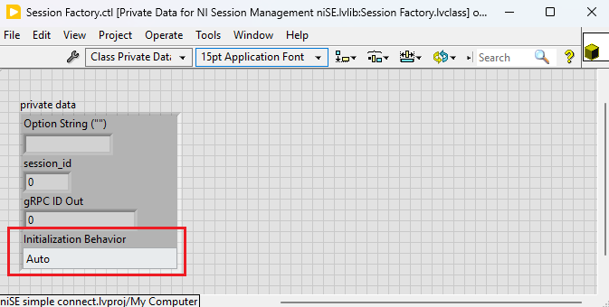

# gRPC DAQmx LabVIEW - Temporary Solution

- [gRPC DAQmx LabVIEW - Temporary Solution](#grpc-daqmx-labview---temporary-solution)
    - [Who](#who)
    - [Feature WorkItem](#feature-workitem)
    - [Problem Statement](#problem-statement)
        - [Key Requirements](#key-requirements)
    - [Workflow](#workflow)
    - [Scope](#scope)
        - [NI DAQmx Server](#ni-daqmx-server)
        - [NI DAQmx Client](#ni-daqmx-client)
    - [Design & Implementation](#design--implementation)
        - [Proto File for NI DAQmx Functions](#proto-file-for-ni-daqmx-functions)
        - [NI DAQmx Server Implementation](#ni-daqmx-server-implementation)
            - [Server-Side Session Management Implementation](#server-side-session-management-implementation)
        - [NI DAQmx Client Implementation](#ni-daqmx-client-implementation)
            - [Client-Side Session Management Implementation](#client-side-session-management-implementation)

## Who

- Author: _National Instruments_
- Team: _Intelligent Validation_

## Feature WorkItem

[Feature: gRPC DAQmx LabVIEW - temporary solution](https://dev.azure.com/ni/DevCentral/_workitems/edit/3055103/)

## Problem Statement

The NI DAQmx is not supported (as of Apr 2025) in terms of session management and reuse across LabVIEW Measurement Plug-in when used in InstrumentStudio or TestStand workflows. gRPC device server support is required to enable the workflows with IS Pro.

### Key Requirements

1. **gRPC Server:** Implement a gRPC server to support DAQmx functions and manage IS Pro session initialization behaviors.
2. **gRPC Client in LabVIEW:** Provide VIs for all gRPC server methods, ensuring connector pane matching and session management using class objects.
3. **TestStand:** Offer helper functions (VIs) for building automation sequences with the DAQmx gRPC driver.
4. **Examples:** Create LabVIEW and TestStand examples demonstrating DAQmx client usage and helper functions.
5. **Deployment:** Deploy the gRPC server and client VIs using NI and VI Packages, respectively.

## Workflow

<!--
    Attach the workflow diagram
-->

### Vision


### User Workflow


## Scope

This feature aims to provide a compatible/equivalent workaround to achieve the IS Pro compatible session management and session reuse without extending the gRPC device server. Once implemented, the M-Plugin developers will be able to use DAQmx with LabVIEW M-Plugins in IS and TS just like other natively supported instrumentation such as nidmm, nidcpower etc.,

### NI DAQmx Server

1. Develop an NI DAQmx gRPC server using the [LabVIEW gRPC Server Client-Code Generation tool](https://github.com/ni/grpc-labview/blob/master/labview%20source/Client%20Server%20Support%20New/gRPC%20Scripting%20Tools/Open%20gRPC%20Server-Client%20%5B2%5D%20-%20Code%20Generator.vi).
2. Implement the gRPC server to support the following NI DAQmx functions and property nodes:  
| NI DAQmx Functions & Property Nodes | Inputs (Data Type) | Outputs (Data Type) |
|:------------------------------------|:-------------------|:--------------------|
| **DAQmx Create Task.vi** | task to copy (DAQmx Task Resource), global virtual channels (DAQmx Global Channel Resource), new task name (String), auto cleanup (Bool) | task out (DAQmx Task Resource) |
| **DAQmx Create Channel (DO-Digital Output).vi** | task in (DAQmx Task Resource), lines (DAQmx Physical Channel Resource), name to assign (String), line grouping (Enum) | task out (DAQmx Task Resource) |
| **DAQmx Create Channel (CI-Frequency).vi** | task in (DAQmx Task Resource), counter (DAQmx Physical Channel Resource), name to assign (String), units (Enum), custom scale name (DAQmx Scale Resource), starting edge (Enum), measurement time (Double), maximum value (Double), minimum value (Double), measurement method (Enum), divisor (uint32) | task out (DAQmx Task Resource) |
| **DAQmx Write (Digital Bool 1Line 1Point).vi** | task/channels in (DAQmx Task Resource), data (Bool), timeout (Double), auto start (Bool) | task out (DAQmx Task Resource), number of samples written per channel (uint32) |
| **DAQmx Read (Counter DBL 1Chan 1Samp).vi** | task/channels in (DAQmx Task Resource), timeout (Double) | task out (DAQmx Task Resource), data (Double) |
| **DAQmx Timing (Implicit).vi** | task/channels in (DAQmx Task Resource), sample mode (Enum) samples per channel (int32) | task out (DAQmx Task Resource) |
| **DAQmx Start Task.vi** | task/channels in (DAQmx Task Resource) | task out (DAQmx Task Resource) |
| **DAQmx Stop Task.vi** | task/channels in (DAQmx Task Resource) | task out (DAQmx Task Resource) |
| **DAQmx Clear Task.vi** | task/channels in (DAQmx Task Resource) | - |
| **DAQmx Task >> Name** | task/channels in (DAQmx Task Resource) | task out (DAQmx Task Resource), Name (DAQmx Task Resource) |
| **DAQmx Channel >> Counter Input : Frequency : Input : Terminal** | task/channels in (DAQmx Task Resource) | task out (DAQmx Task Resource), CI.Freq.Term (NI Terminal Resource) |
| **DAQmx Channel >> Counter Input : Frequency : Measurement Specifications : High Frequency : Measurement Time** | task/channels in (DAQmx Task Resource) | task out (DAQmx Task Resource), CI.Freq.Meas.Time (Double) |

3. Ensure support for all five initialization behaviors required for IS Pro session management:
    - Auto
    - Initialize and Close
    - Attach and Detach
    - Initialize and Detach
    - Attach and Close

### NI DAQmx Client

1. Generate an NI DAQmx gRPC client using the LabVIEW gRPC Server Client-Code Generation tool for all implemented DAQmx methods.
2. Ensure the connector pane of the client VIs matches the equivalent DAQmx driver VIs.
3. Use class objects to store gRPC session IDs, aligning with DAQmx session behavior.
4. Organize the gRPC client VIs in a function palette equivalent to the native DAQmx driver.

## Design & Implementation

### Proto File for NI DAQmx Functions

1. The Proto file for NI DAQmx functions is available in the [ni/gRPC-device repository](https://github.com/ni/grpc-device/blob/main/generated/nidaqmx/nidaqmx.proto).
2.  The gRPC proto service definitions for the required NI DAQmx [functions](Images/DAQmx_Functions.png) and [property nodes](Images/DAQmx_Property_Nodes.png) are as follows:
```proto
syntax = "proto3";

option java_multiple_files = true;
option java_package = "com.ni.grpc.nidaqmx";
option java_outer_classname = "NiDAQmx";
option csharp_namespace = "NationalInstruments.Grpc.NiDAQmx";

package nidaqmx_grpc;

import "session.proto";
import "google/protobuf/timestamp.proto";

service NiDAQmx {
    rpc CreateTask(CreateTaskRequest) returns (CreateTaskResponse);
    rpc CreateDOChan(CreateDOChanRequest) returns (CreateDOChanResponse);
    rpc CreateCIFreqChan(CreateCIFreqChanRequest) returns (CreateCIFreqChanResponse);
    rpc WriteDigitalLines(WriteDigitalLinesRequest) returns (WriteDigitalLinesResponse);
    rpc ReadCounterScalarF64(ReadCounterScalarF64Request) returns (ReadCounterScalarF64Response);
    rpc CfgImplicitTiming(CfgImplicitTimingRequest) returns (CfgImplicitTimingResponse);
    rpc StartTask(StartTaskRequest) returns (StartTaskResponse);
    rpc StopTask(StopTaskRequest) returns (StopTaskResponse);
    rpc ClearTask(ClearTaskRequest) returns (ClearTaskResponse);
    rpc GetTaskAttributeString(GetTaskAttributeStringRequest) returns (GetTaskAttributeStringResponse);
    rpc GetChanAttributeString(GetChanAttributeStringRequest) returns (GetChanAttributeStringResponse);
    rpc GetChanAttributeDouble(GetChanAttributeDoubleRequest) returns (GetChanAttributeDoubleResponse);
    rpc SetChanAttributeString(SetChanAttributeStringRequest) returns (SetChanAttributeStringResponse);
    rpc SetChanAttributeDouble(SetChanAttributeDoubleRequest) returns (SetChanAttributeDoubleResponse);
}
```
> [!NOTE]
> The NI DAQmx proto file in the [ni/gRPC-device repository](https://github.com/ni/grpc-device/blob/main/generated/nidaqmx/nidaqmx.proto) is implemented in Python and supports the NI gRPC device server. These proto file methods are reused in LabVIEW to replicate the session management workflow.

### NI DAQmx Server Implementation

1. Use the LabVIEW gRPC Server Client-Code Generation tool with the NI DAQmx proto file as input to generate a gRPC server template for the defined methods.
2. Develop LabVIEW wrappers for the NI DAQmx driver functions and property nodes.
3. Implement session management on the server using a session map: `{Session Name (String): Task (Refnum)}`.
4. A wrapper that Logs errors from driver wrappers in server to gRPC client.

#### Server-Side Session Management Implementation

- **Method Name:** `CreateTask Wrapper`
    - **Inputs:** 
        - `session_name` (string)
        - `initialization_behavior` (enum)
    - **Outputs:**
        - `status` (int32)
        - `task` (session object)
        - `new_session_initialized` (bool)
    - **Initialization Behaviour Implementation:**
        - **AUTO:** If the task exists, attach (`Attach and Detach`) to it (`new_session_initialized` = `False`). Otherwise, create (`Initialize and Close`) a new task (`new_session_initialized` = `True`).
        - **INITIALIZE_NEW:** If the task exists, return `ALREADY_EXISTS` error. Otherwise, create a new task (`new_session_initialized` = `True`).
        - **ATTACH_TO_EXISTING:** If the session exists, attach to it (`new_session_initialized` = `False`). Otherwise, return a `SESSION_NOT_FOUND` error.
- **Method Name:** `ClearTask Wrapper`
    - **Inputs:** 
        - `task` (session object)
    - **Outputs:**
        - `status` (int32)
    - **Close Behaviour Implementation:**
        - Checks if the session map is empty. If the session map is empty, throw `SESSION_NOT_FOUND` error. Else clears the respective task and remove the task from map.

### NI DAQmx Client Implementation

1. Utilize the LabVIEW gRPC Server Client-Code Generation tool with the NI DAQmx proto file to create a gRPC client template for the specified methods.
2. Develop LabVIEW wrappers for the NI DAQmx client methods to ensure the connector pane matches the corresponding DAQmx functions and property nodes.
3. Implement logic for Initialize and Close Measurement Plug-In session by overriding the session methods of ISession Factory.lvclass which includes: 
    - ***Initialize MeasurementLink Session.vi*** - Initializes the measurement plug-ins session for the instrument selected.
    - ***Get Instrument Type ID.vi*** - Gets the instrument type ID mentioned in the pin map file for the selected instrument.
    - ***Get Provided Interface and Service Class.vi*** - Returns the provided interface and service class that will be used to query the NI Discovery service for the address and port of the instrument's gRPC server.
    - ***Close MeasurementLink Session.vi*** - Closes the local measurement plug-ins session.
4. The Measurement Plug-In `Initialize MeasurementLink Session.vi` and `Close MeasurementLink Session.vi` VIs internally utilize the NI DAQmx `Create Task` and `Clear Task` client wrappers for session management.
5. Develop a `Create.vi` to store the session initialization and close behavior enum within the session object.  
    
6. Create `Initialize Sessions - 1Sess.vi` wrapper to initialize the NI DAQmx driver session. This wrapper should first invoke the `Create.vi` to set the session behavior, followed by calling the `NI Session Management V1 Client.lvlib: Session Reservation.lvclass: Initialize Session.vim`.  
    

#### Client-Side Session Management Implementation

- **Method Name:** `Initialize MeasurementLink Session.vi`
    - **Inputs:** 
        - `session factory in` (class object)
        - `initialize and close session behavior` (enum)
        - `session initialization parameters` (cluster)
        - `remote connection options` (cluster)
    - **Outputs:**
        - `session factory out` (class object)
        - `session out` (refnum)
    - **Initialization Behavior:**
        - The initialization behavior enum for the measurement plug-in is derived from the session factory object instead of the `initialize and close session behavior` input.  
        
            - This is because the `initialize and close session behavior` input of `Initialize MeasurementLink Session.vi` does not include the `Auto` behavior required for the DAQmx server.  
            
        - Map the five measurement plug-in initialization behavior enum values to the following:
            - `Auto` -> SESSION_INITIALIZATION_BEHAVIOR_UNSPECIFIED
            - `Initialize and Close` and `Initialize and Detach` -> SESSION_INITIALIZATION_BEHAVIOR_INITIALIZE_NEW
            - `Attach and Close` and `Attach and Detach` -> SESSION_INITIALIZATION_BEHAVIOR_ATTACH_TO_EXISTING
    - Use the `Create Client` and `Create Task` methods within this VI to manage tasks on the server.
    - The `Create Task` client method returns a `new_session_initialized` boolean, which determines the close behavior for `Auto` as follows:
        - If the initialization behavior is `Auto` and `new_session_initialized` is `True`, the close behavior is `Initialize and Close`.
        - If the initialization behavior is `Auto` and `new_session_initialized` is `False`, the close behavior is `Attach and Detach`.
        - For the other four initialization behaviors, the `new_session_initialized` value is not relevant.  
        
- **Method Name:** `Close MeasurementLink Session.vi`
    - **Inputs:** 
        - `session factory in` (class object)
        - `initialize and close session behavior` (enum)
        - `session in` (refnum)
    - **Initialize and Close Behaviour:** 
        - **Initialize and Detach / Attach and Detach:** No action is required.
        - **Initialize and Close / Attach and Close:** Invoke the gRPC client method to clear the task.
    - Clear the task based on the initialize and close behaviour and destroy the client.
