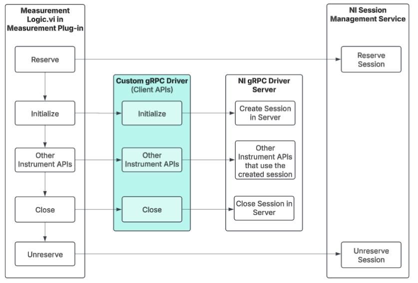

# gRPC support for NI Switch Driver in LabVIEW - Temporary Solution

## Table of Contents

- [gRPC support for NI Switch Driver in LabVIEW - Temporary Solution](#grpc-support-for-ni-switch-driver-in-labview---temporary-solution)
  - [Table of Contents](#table-of-contents)
  - [Who](#who)
  - [Feature WorkItem](#feature-workitem)
  - [Problem Statement](#problem-statement)
  - [Proposed Solution](#proposed-solution)
  - [Workflow](#workflow)
  - [Key Requirements](#key-requirements)
  - [Requested NI Switch Functions](#requested-ni-switch-functions)
  - [Scope](#scope)
    - [NI Switch Client](#ni-switch-client)
    - [TestStand](#teststand)
    - [Examples](#examples)
  - [Design \& Implementation](#design--implementation)
    - [Overview](#overview)
    - [Proto File for NI Switch Functions](#proto-file-for-ni-switch-functions)
    - [NI Switch gRPC Client Creation](#ni-switch-grpc-client-creation)
    - [Session Management Implementation in Client](#session-management-implementation-in-client)
    - [Switch LabVIEW Client Deployment](#switch-labview-client-deployment)

## Who

- Author: _National Instruments_
- Team: _Intelligent Validation_

## Feature WorkItem

[Feature: gRPC support for NI Switch Driver in LabVIEW - Temporary
solution](https://dev.azure.com/ni/DevCentral/_workitems/edit/3090970/)

## Problem Statement

NI gRPC device server supports session management and session reuse of NI Switch. Python Clients are available to interface with NI gRPC device server. However NI Switch (as of Apr 2025) cannot access NI gRPC device server in LabVIEW Measurement Plug-in due to absence of LabVIEW Client.

## Proposed Solution

LabVIEW gRPC client will be created to access the NI GRPC device server for session reuse across LabVIEW Measurement Plug-ins and the clients will be integrated with Session Management APIs to enable session management.

## Workflow



## Key Requirements

1. **gRPC Client in LabVIEW:** Provide VIs for all gRPC server methods, ensuring connector pane matching and session management using class objects.
2. **Examples:** Create LabVIEW and TestStand examples demonstrating Switch client usage and helper functions.
3. **TestStand helper functions:** Offer helper functions (VIs) to enable session sharing across measurement plug-ins in the automation sequence example of this Switch gRPC driver.

## Requested NI Switch Functions

Client wrappers will be created for the below NI Switch functions to interface with the NI gRPC device server, which will be exposed in the Measurement IO palette palette.

| **Function Name**             | **Description**                                                        | **Input/Output**              | **Data Type**         |
| ----------------------------- | ---------------------------------------------------------------------- | ----------------------------- | --------------------- |
| `Initialize With Topology.vi` | Returns a session handle and sets the topology of the switch module.   | `resource name` (in)          | niSwitch IVI Session  |
|                               |                                                                        | `topology name` (in)          | String                |
|                               |                                                                        | `simulate` (in)               | Boolean               |
|                               |                                                                        | `reset device` (in)           | Boolean               |
|                               |                                                                        | `instrument handle out` (out) | niSwitch IVI Session  |
| `Relay Control.vi`            | Controls individual relays of the switch module.                       | `instrument handle` (in)      | niSwitch IVI Session  |
|                               |                                                                        | `relay names` (in)            | String                |
|                               |                                                                        | `relay action` (in)           | Enum                  |
|                               |                                                                        | `instrument handle out` (out) | niSwitch IVI Session  |
| `Get Relay Position.vi`       | Returns the relay position for the relay specified in relay name.      | `instrument handle` (in)      | niSwitch IVI Session  |
|                               |                                                                        | `relay name` (in)             | String                |
|                               |                                                                        | `instrument handle out` (out) | niSwitch IVI Session  |
|                               |                                                                        | `position` (in)               | Enum                  |
| `Wait For Debounce.vi`        | Pauses until all created paths have settled.                           | `instrument handle` (in)      | niSwitch IVI Session  |
|                               |                                                                        | `maximum time` (in)           | Int 32                |
|                               |                                                                        | `instrument handle out` (out) | niSwitch IVI Session  |
| `Close.vi`                    | Terminates the NI-SWITCH session                                       | `instrument handle` (in)      | niSwitch IVI Session  |


## Scope

This feature aims to provide a client to achieve the IS Pro compatible session management and session reuse in LabVIEW measurement plug-ins by interfacing with the NI gRPC device server. Once implemented, the M-Plugin developers will be able to use Switch with LabVIEW M-Plugins in IS and TS just like other natively supported instrumentation such as nidmm, nidcpower etc.,

### NI Switch Client

1. Generate an NI Switch gRPC client using the LabVIEW [gRPC Server Client-Code Generation tool](https://github.com/ni/grpc-labview/blob/master/labview%20source/Client%20Server%20Support%20New/gRPC%20Scripting%20Tools/Open%20gRPC%20Server-Client%20%5B2%5D%20-%20Code%20Generator.vi) for all implemented Switch methods.
2. Implement session management by overriding the `ISession Factory` interface. This ensures proper initialization and closure of each session with the required configuration parameters. 
3. Develop high-level wrappers that replicate the connector panes of the LabVIEW Switch driver to provide a user-friendly interface.
4. Organize the gRPC client VIs in a function palette equivalent to the native Switch driver.

### TestStand

1. Helper functions (VIs) to build automation sequences with Switch gRPC driver

### Examples

1. LabVIEW M-Plugin example demonstrating the Switch client usage
2. TestStand sequence example demonstrating the helper function usage and M-Plugins with Switch calls

## Design & Implementation

### Overview

<!-- Inset Preface/Overview for Design and Implementation -->
The gRPC Device server supports Switch functions; however, LabVIEW wrappers are not yet available. Below is a high-level workflow for creating a custom client interface to enable IS Pro-compatible session management and session reuse:

1. **Create proto file for the NI Switch functions**
    - A .proto file is used to define the structure of the data and the services for gRPC communication. For NI Switch functions, this file will describe the remote procedure calls (RPCs) and the data types (messages) needed to interact with the Switch API.
    - It acts as the contract between the client and gRPC device server, ensuring both sides understand the data and operations.
2. **Create Client Stubs for the NI Switch Functions**
    - The client provides an interface for users to call the Switch methods remotely.
    - This enables remote communication between the client and gRPC device server, allowing distributed systems to interact with the Switch API.
3. **Client-Side Session Management Implementation**  
    - After generating the gRPC client, implement session management by overriding the `ISession Factory` interface methods which includes: 
        - ***Initialize MeasurementLink Session.vi*** - Initializes the measurement plug-ins session for the instrument selected.
        - ***Get Instrument Type ID.vi*** - Gets the instrument type ID mentioned in the pin map file for the selected instrument.
        - ***Get Provided Interface and Service Class.vi*** - Returns the provided interface and service class that will be used to query the NI Discovery service for the address and port of the instrument's gRPC server.
        - ***Close MeasurementLink Session.vi*** - Closes the local measurement plug-ins session.
    - This ensures proper initialization and closure of each session with the required configuration parameters.  
    - Develop high-level wrappers that replicate the connector panes of the LabVIEW Switch driver to provide a user-friendly interface.
4. **Client Wrappers for all requested APIs**
    - Develop client wrappers for each of the Switch functions defined above, ensuring they adhere to the expected input and output structures, and facilitate seamless communication with the gRPC server.
5. **Switch LabVIEW Client Deployment**
    - A VI package that installs the Switch client methods in the target PC and adds the wrappers to the LabVIEW functions palette.

### Proto File for NI Switch Functions

1. The Proto file for NI Switch functions is available in the [ni/gRPC-device
   repository](https://github.com/ni/grpc-device/blob/main/generated/niswitch/niswitch.proto).
2. The gRPC proto service definitions for the required NI Switch functions are
   as follows:

```proto
syntax = "proto3";

option java_multiple_files = true;
option java_package = "com.ni.grpc.niswitch";
option java_outer_classname = "NiSwitch";
option csharp_namespace = "NationalInstruments.Grpc.Switch";

package niswitch_grpc;

import "session.proto";

service NiSwitch {
    rpc InitWithTopology(InitWithTopologyRequest) returns (InitWithTopologyResponse);
    rpc RelayControl(RelayControlRequest) returns (RelayControlResponse);
    rpc GetRelayPosition(GetRelayPositionRequest) returns (GetRelayPositionResponse);
    rpc WaitForDebounce(WaitForDebounceRequest) returns (WaitForDebounceResponse);
    rpc Close(CloseRequest) returns (CloseResponse);
}
```

> [!NOTE]  
> The NI Switch proto file in the [ni/gRPC-device
> repository](https://github.com/ni/grpc-device/blob/main/generated/niswitch/niswitch.proto)
> is implemented in Python and supports the NI gRPC device server. These proto
> file methods are reused in LabVIEW to replicate the session management
> workflow.

### NI Switch gRPC Client Creation

1. Utilize the LabVIEW [gRPC Server Client-Code Generation tool](https://github.com/ni/grpc-labview/blob/master/labview%20source/Client%20Server%20Support%20New/gRPC%20Scripting%20Tools/Open%20gRPC%20Server-Client%20%5B2%5D%20-%20Code%20Generator.vi) with the NI Switch proto file to create a gRPC client template for the specified methods.

### Session Management Implementation in Client

1. The session management library inherits the following VIs from ISession Factory for managing NI Switch sessions. The generate gRPC clients are called within the below VIs:

| **Method Name** | **Inputs** | **Outputs** | **Details** |
|-----------------|------------|-------------|-------------|
| **Initialize MeasurementLink Session.vi** | - `session factory in` (class object) <br> - `initialize and close session behavior` (enum) <br> - `session initialization parameters` (cluster) <br> - `remote connection options` (cluster) | - `session factory out` (class object) <br> - `session out` (refnum) | Use the `Create Client` and `Initialize With Topology` methods within this VI to create niSwitch IVI sessions on the server. |
| **Get Instrument Type ID.vi** | - `session factory in` (class object) | - `session factory out` (class object) <br> - `instrument type id` (string) | Set the `instrument type id` output to a string constant with the value `niSwitch`. |
| **Get Provided Interface and Service Class.vi** | - `session factory in` (class object) | - `session factory out` (class object) <br> - `provided interface` (string) <br> - `service class` (string) | Set the `provided interface` output to a string constant with the value `niswitch_grpc.NiSwitch`. <br> Set the `service class` output to a string constant with the value `ni.measurementlink.v1.grpcdeviceserver`. |
| **Close MeasurementLink Session.vi** | - `session factory in` (class object) <br> - `initialize and close session behavior` (enum) <br> - `session in` (refnum) <br> - `remote connection options` (cluster) | - | Use the `Close` and `Destroy Client` methods within this VI to close niSwitch IVI sessions on the server. |

2. Below VIs are Driver specific wrappers in the session management library that are specific to the NI Switch driver, which will be exposed in the Measurement IO Palette to the user.

| **VI Name**                | **Description**                                                                 |
|----------------------------|---------------------------------------------------------------------------------|
| **Initialize Sessions 1Sess.vi** | Creates a single NI Switch driver Session using the provided session reservation.    |
| **Initialize Sessions NSess.vi** | Creates multiple NI Switch driver Session using the provided session reservation.   |
| **Initialize Sessions.vi**      | A polymorphic VI that combines `Initialize Sess 1Sess.vi` and `Initialize Sess NSess.vi`. |
| **Instrument Type ID.vi**    | Returns a string constant representing the instrument type ID for NI Switch instruments. |


3. Develop wrappers for each of the requested Switch functions, ensuring that their input and output connector panes closely match the format of the corresponding native driver functions.
4. The replication of measurement plug-in session initialization wrapper for Switch `Initialize Sess 1Sess.vi` and `Initialize Sess NSess.vi` includes a `Create.vi` and the measurement plug-in `NI Session Management V1 Client.lvlib: Session Reservation.lvclass: Initialize Session(s).vim`. We need to develop the `Create.vi` to use it in the initialization wrapper.  


### Switch LabVIEW Client Deployment

1. Deploy the gRPC Switch client VIs to the `Measurement I/O > Custom gRPC Driver Clients > NI Switch gRPC` section of the LabVIEW functions palette via a VI package. 
2. The VIs will be installed in the `C:\Program Files\National Instruments\LabVIEW <version>\instr.lib\NI Switch gRPC Client` directory.
