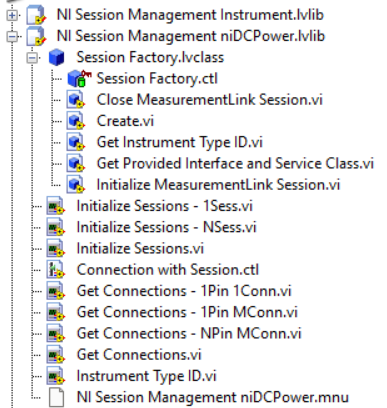
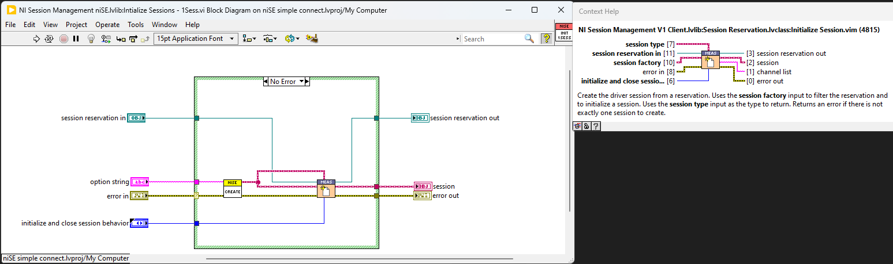

# gRPC Switch Executive LabVIEW - Temporary Solution

## Table of Contents

- [gRPC Switch Executive LabVIEW - Temporary Solution](#grpc-switch-executive-labview---temporary-solution)
  - [Table of Contents](#table-of-contents)
  - [Who](#who)
  - [Feature WorkItem](#feature-workitem)
  - [Problem Statement](#problem-statement)
  - [Proposed Solution](#proposed-solution)
  - [Workflow](#workflow)
    - [Key Requirements](#key-requirements)
    - [Requested NI Switch Executive Functions and Property Nodes](#requested-ni-switch-executive-functions-and-property-nodes)
- [NI Switch Executive Functions](#ni-switch-executive-functions)
  - [Scope](#scope)
    - [NI Switch Executive Server](#ni-switch-executive-server)
    - [NI Switch Executive Client](#ni-switch-executive-client)
    - [TestStand](#teststand)
    - [Examples](#examples)
  - [Design \& Implementation](#design--implementation)
    - [Overview](#overview)
    - [Proto File for NI Switch Executive Functions](#proto-file-for-ni-switch-executive-functions)
    - [NI Switch Executive Server Implementation](#ni-switch-executive-server-implementation)
    - [NI Switch Executive gRPC Client Implementation](#ni-switch-executive-grpc-client-implementation)
    - [Session Management Implementation in Client](#session-management-implementation-in-client)
    - [Switch Executive LabVIEW Client Deployment](#switch-executive-labview-client-deployment)

## Who

- Author: _National Instruments_
- Team: _Intelligent Validation_

## Feature WorkItem

[Feature: gRPC Switch Executive LabVIEW - temporary solution](https://dev.azure.com/ni/DevCentral/_workitems/edit/3055103/)

## Problem Statement

The NI Switch Executive is not supported (as of Apr 2025) in terms of session management and reuse across LabVIEW Measurement Plug-in when used in InstrumentStudio or TestStand workflows. gRPC device server support is required to enable the workflows with IS Pro.

## Proposed Solution

LabVIEW gRPC Server and client will be created to access the NI Switch Executive server for session reuse across LabVIEW Measurement Plug-ins and the server-client will be integrated with Session Management APIs to enable session management.

## Workflow


### Key Requirements

1. **gRPC Server:** Implement a gRPC server to support Switch Executive functions and manage IS Pro session initialization behaviors.
2. **gRPC Client in LabVIEW:** Provide VIs for all gRPC server methods, ensuring connector pane matching and session management using class objects.
3. **TestStand:** Offer helper functions (VIs) for building automation sequences with the Switch Executive gRPC driver.
4. **Examples:** Create LabVIEW and TestStand examples demonstrating Switch Executive client usage and helper functions.

### Requested NI Switch Executive Functions and Property Nodes

Client wrappers will be created for the below NI Switch Executive functions and property nodes to interface with the NI gRPC device server, which will be exposed in the Measurement IO palette palette.

# NI Switch Executive Functions

| **Function Name** | **Description**                                                        | **Input/Output**                   | **Data Type** |
| ------------------| ---------------------------------------------------------------------- | ---------------------------------- | ------------- |
| `Open Session`    | Opens a session to a specified NI Switch Executive virtual device.     | `Virtual Device Name` (in)         | String        |
|                   |                                                                        | `Option String` (in)               | String        |
|                   |                                                                        | `error in` (in)                    | Cluster       |
|                   |                                                                        | `NISE Session` (out)               | Refnum        |
|                   |                                                                        | `error out` (out)                  | Cluster       |
| `Close Session`   | Reduces the reference count of open sessions by one.                   | `NISE Session` (in)                | Refnum        |
|                   |                                                                        | `error in` (in)                    | Cluster       |
|                   |                                                                        | `error out` (out)                  | Cluster       |
| `Connect`         | Connects the routes specified by the connection specification.         | `NISE Session` (in)                | Refnum        |
|                   |                                                                        | `Connection Specification` (in)    | String        |
|                   |                                                                        | `Wait For Debounce` (in)           | Boolean       |
|                   |                                                                        | `Multiconnect Mode` (in)           | Enum          |
|                   |                                                                        | `error in` (in)                    | Cluster       |
|                   |                                                                        | `NISE Session` (out)               | Refnum        |
|                   |                                                                        | `error out` (out)                  | Cluster       |
| `Disconnect`      | Disconnects the routes specified in the disconnection specification.   | `NISE Session` (in)                | Refnum        |
|                   |                                                                        | `Disconnection Specification` (in) | String        |
|                   |                                                                        | `error in` (in)                    | Cluster       |
|                   |                                                                        | `NISE Session` (out)               | Refnum        |
|                   |                                                                        | `error out` (out)                  | Cluster       |
| `Is Connected`    | Checks to see whether the specified route or route group is connected. | `NISE Session` (in)                | Refnum        |
|                   |                                                                        | `Route Specification` (in)         | String        |
|                   |                                                                        | `error in` (in)                    | Cluster       |
|                   |                                                                        | `NISE Session` (out)               | Refnum        |
|                   |                                                                        | `Is Connected?` (out)              | Boolean       |
|                   |                                                                        | `error out` (out)                  | Cluster       |
| `Disconnect All`  | Disconnects all connections managed by the session reference.          | `NISE Session` (in)                | Refnum        |
|                   |                                                                        | `error in` (in)                    | Cluster       |
|                   |                                                                        | `NISE Session` (out)               | Refnum        |
|                   |                                                                        | `error out` (out)                  | Cluster       |

## Scope

This feature aims to provide a compatible/equivalent workaround to achieve the IS Pro compatible session management and session reuse without extending the gRPC device server. Once implemented, the M-Plugin developers will be able to use Switch Executive with LabVIEW M-Plugins in IS and TS just like other natively supported instrumentation such as nidmm, nidcpower etc.,

### NI Switch Executive Server

1. Develop an NI Switch Executive gRPC server using the [LabVIEW gRPC Server Client-Code Generation tool](https://github.com/ni/grpc-labview/blob/master/labview%20source/Client%20Server%20Support%20New/gRPC%20Scripting%20Tools/Open%20gRPC%20Server-Client%20%5B2%5D%20-%20Code%20Generator.vi).
2. Implement the gRPC server to support the requested NI Switch Executive functions and property nodes.
3. Ensure support for all five initialization behaviors required for IS Pro session management:
    - Auto
    - Initialize and Close
    - Attach and Detach
    - Initialize and Detach
    - Attach and Close

### NI Switch Executive Client

1. Generate an NI Switch Executive gRPC client using the LabVIEW [gRPC Server Client-Code Generation tool](https://github.com/ni/grpc-labview/blob/master/labview%20source/Client%20Server%20Support%20New/gRPC%20Scripting%20Tools/Open%20gRPC%20Server-Client%20%5B2%5D%20-%20Code%20Generator.vi) for all implemented Switch Executive methods.
2. Implement session management by overriding the `ISession Factory` interface. This ensures proper initialization and closure of each session with the required configuration parameters.
3. Develop high-level wrappers that replicate the connector panes of the LabVIEW Switch Executive driver to provide a user-friendly interface.
4. Organize the gRPC client VIs in a function palette equivalent to the native Switch Executive driver.

### TestStand

1. Helper functions (VIs) to build automation sequences with Switch Executive gRPC driver

### Examples

1. LabVIEW M-Plugin example demonstrating the Switch Executive client usage
2. TestStand sequence example demonstrating the helper function usage and M-Plugins with Switch Executive calls

## Design & Implementation

### Overview

<!-- Inset Preface/Overview for Design and Implementation -->

A high-level workflow for implementing custom gRPC Server and Client interface to achieve the IS Pro compatible session management and session reuse without extending the gRPC device server is given below:

1. **Create proto file for the NI Switch Executive functions**
    - A .proto file is used to define the structure of the data and the services for gRPC communication. For NI Switch Executive functions, this file will describe the remote procedure calls (RPCs) and the data types (messages) needed to interact with the Switch Executive API.
    - It acts as the contract between the client and server, ensuring both sides understand the data and operations.
2. **Server Implementation**
    - The server has the low-level Switch Executive driver APIs and property nodes.
    - Within the gRPC server, implement the logic to initialize and manage sessions based on the selected initialization behavior.
    - The server needs to manage Switch Executive sessions (e.g., tasks or resources) efficiently. This involves creating, tracking, and cleaning up sessions to avoid resource leaks.
    - This ensures that multiple clients can interact with the server without conflicts or resource exhaustion.
3. **Create Client Stubs for the NI Switch Executive Functions**
    - The client provides an interface for users to call the Switch Executive methods remotely.
    - This enables remote communication between the client and gRPC device server, allowing distributed systems to interact with the Switch Executive API.
4. **Client-Side Session Management Implementation**  
    - After generating the gRPC client, implement session management by overriding the `ISession Factory` interface methods which includes:
        - _**Initialize MeasurementLink Session.vi**_ - Initializes the measurement plug-ins session for the instrument selected.
        - _**Get Instrument Type ID.vi**_ - Gets the instrument type ID mentioned in the pin map file for the selected instrument.
        - _**Get Provided Interface and Service Class.vi**_ - Returns the provided interface and service class that will be used to query the NI Discovery service for the address and port of the instrument's gRPC server.
        - _**Close MeasurementLink Session.vi**_ - Closes the local measurement plug-ins session.
    - This ensures proper initialization and closure of each session with the required configuration parameters.  
    - Develop high-level wrappers that replicate the connector panes of the LabVIEW Switch Executive driver to provide a user-friendly interface.
5. **Switch Executive LabVIEW Client Deployment**
    - A VI package that installs the Switch Executive client methods in the target PC and adds the wrappers to the LabVIEW functions palette.

### Proto File for NI Switch Executive Functions

1. The gRPC proto service definitions for the required NI Switch Executive [functions](Images/Switch Executive_Functions.png) and [property nodes](Images/Switch Executive_Property_Nodes.png) are as follows:

```proto
syntax = "proto3";

option java_multiple_files = true;
option java_outer_classname = "NiSwitchExecutive";
option java_package = "com.ni.grpcsupport.nise";
option objc_class_prefix = "NISE";

package niswitchexecutive_grpc;

import "session.proto";

service NiSwitchExecutive {
 rpc OpenSession(OpenSessionRequest) returns (OpenSessionResponse) {}
 rpc CloseSession(CloseSessionRequest) returns (CloseSessionResponse) {}
 rpc Connect(ConnectRequest) returns (ConnectResponse) {}
 rpc Disconnect(DisconnectRequest) returns (DisconnectResponse) {}
 rpc IsConnected(IsConnectedRequest) returns (IsConnectedResponse) {}
 rpc DisconnectAll(DisconnectAllRequest) returns (DisconnectAllResponse) {}
}
```

### NI Switch Executive Server Implementation

1. Use the LabVIEW gRPC Server Client-Code Generation tool with the NI Switch Executive proto file as input to generate a gRPC server template for the defined methods.
2. Develop LabVIEW wrappers for the NI Switch Executive driver functions and property nodes.
3. Implement session storage on the server using a session map: `{Session Name (String): Resource name (Refnum)}`.
4. A wrapper that Logs errors and parses the error from driver wrappers in server to gRPC client.
5. The `Initialize` method returns a `new_session_initialized` boolean, which determines the close behavior for `Auto` as follows:
    - If the initialization behavior is `Auto` and `new_session_initialized` is `True`, the close behavior is `Initialize and Close`.
    - If the initialization behavior is `Auto` and `new_session_initialized` is `False`, the close behavior is `Attach and Detach`.  
    


### NI Switch Executive gRPC Client Implementation

1. Utilize the LabVIEW [gRPC Server Client-Code Generation tool](https://github.com/ni/grpc-labview/blob/master/labview%20source/Client%20Server%20Support%20New/gRPC%20Scripting%20Tools/Open%20gRPC%20Server-Client%20%5B2%5D%20-%20Code%20Generator.vi) with the NI Switch Executive proto file to create a gRPC client template for the specified methods.

### Session Management Implementation in Client

1. The session management library inherits the following VIs from ISession Factory for managing NI DAQmx sessions. The generate gRPC clients are called within the below VIs

| **Method Name**                     | **Inputs**                                                                                                                                                                                                 | **Outputs**                                                                                                           | **Details**                                                                                                                                                                                                                     |
|-------------------------------------|----------------------------------------------------------------------------------------------------------------------------------------------------------------------------------------------------------|-----------------------------------------------------------------------------------------------------------------------|---------------------------------------------------------------------------------------------------------------------------------------------------------------------------------------------------------------------------------|
| **Initialize MeasurementLink Session.vi** | - `session factory in` (class object) <br> - `initialize and close session behavior` (enum) <br> - `session initialization parameters` (cluster) <br> - `remote connection options` (cluster)            | - `session factory out` (class object) <br> - `session out` (refnum)                                                  | Use the `Create Client` and `Initialize` methods within this VI to create session on the server.                                                                                                                               |
| **Get Instrument Type ID.vi**         | - `session factory in` (class object)                                                                                                                                                                    | - `session factory out` (class object) <br> - `instrument type id` (string)                                           | Set the `instrument type id` output to a string constant with the value `NISwitch Executive`.                                                                                                                                            |
| **Get Provided Interface and Service Class.vi** | - `session factory in` (class object)                                                                                                                                                                    | - `session factory out` (class object) <br> - `provided interface` (string) <br> - `service class` (string)           | Set the `provided interface` output to a string constant with the value `niSwitch Executive_grpc.NiSwitch Executive`. <br> Set the `service class` output to a string constant with the value `ni.measurementlink.v1.grpcdeviceserver`.               |
| **Close MeasurementLink Session.vi**  | - `session factory in` (class object) <br> - `initialize and close session behavior` (enum) <br> - `session in` (refnum) <br> - `remote connection options` (cluster)                                    | -                                                                                                                     | Clear the session based on the initialize and close behaviour and destroy the client. For `Initialize and Detach / Attach and Detach:` No action is required. For `Initialize and Close / Attach and Close:` Invoke the gRPC client method to close the session.                                                                                                                               |

2. Below VIs are Driver specific wrappers in the session management library that are specific to the NI Switch driver, which will be exposed in the Measurement IO Palette to the user.

| **VI Name**                | **Description**                                                                 |
|----------------------------|---------------------------------------------------------------------------------|
| **Initialize Sessions 1Sess.vi** | Creates a single NI Switch Executive driver Session using the provided session reservation.    |
| **Initialize Sessions NSess.vi** | Creates multiple NI Switch Executive driver Session using the provided session reservation.   |
| **Initialize Sessions.vi**      | A polymorphic VI that combines `Initialize Sess 1Sess.vi` and `Initialize Sess NSess.vi`. |
| **Instrument Type ID.vi**    | Returns a string constant representing the instrument type ID for NI Switch Executive instruments. |



3. Develop wrappers for each of the requested Switch Executive functions, ensuring that their input and output connector panes closely match the format of the corresponding native driver functions.
4. The replication of measurement plug-in session initialization wrapper for Switch Executive `Initialize Session 1Sess.vi` and `Initialize Session NSess.vi` includes a `Create.vi` and the measurement plug-in `NI Session Management V1 Client.lvlib: Session Reservation.lvclass: Initialize Session(s).vim`. We need to develop the `Create.vi` to use it in the initialization wrapper.  


5. Map the five measurement plug-in initialization behavior enum values to the following:
    - `Auto` -> SESSION_INITIALIZATION_BEHAVIOR_UNSPECIFIED
    - `Initialize and Close` and `Initialize and Detach` -> SESSION_INITIALIZATION_BEHAVIOR_INITIALIZE_NEW
    - `Attach and Close` and `Attach and Detach` -> SESSION_INITIALIZATION_BEHAVIOR_ATTACH_TO_EXISTING

### Switch Executive LabVIEW Client Deployment

1. Deploy the gRPC Switch Executive client VIs to the `Measurement I/O > Custom gRPC Driver Clients > NI Switch Executive gRPC` section of the LabVIEW functions palette via a VI package.
2. The VIs will be installed in the `C:\Program Files\National Instruments\LabVIEW <version>\instr.lib\NI Switch Executive gRPC` directory.
