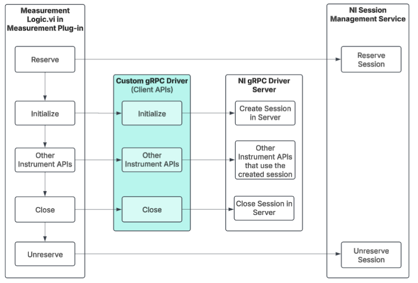

# Custom gRPC Drivers

- [Custom gRPC Drivers](#custom-grpc-drivers)
  - [Introduction](#introduction)
  - [Software support](#software-support)
  - [Installation](#installation)
  - [Workflow](#workflow)
  - [Using the Custom gRPC Drivers](#using-the-custom-grpc-drivers)
  - [Examples](#examples)
  - [Note](#note)

---

## Introduction

The Custom gRPC Drivers package offers NI gRPC Device Server interface APIs for NI-Switch and NI-DAQmx drivers in LabVIEW. These APIs facilitate efficient communication between LabVIEW applications and hardware devices using the gRPC protocol, enabling session sharing across LabVIEW Measurement Plug-ins.

## Software support

- [InstrumentStudio 2024 Q4](https://www.ni.com/en/support/downloads/software-products/download.instrumentstudio.html#549673) or later
- [LabVIEW 2021 SP1](https://www.ni.com/en/support/downloads/software-products/download.labview.html#487445) or later
  - [JKI VI Package Manager 2021 SP1](https://www.ni.com/en/support/downloads/tools-network/download.jki-vi-package-manager.html#443251) or later
    - [Measurement Plug-In SDK v3.1.0.6](https://www.ni.com/docs/en-US/bundle/measurementplugins/page/labview-measurement-dependencies.html) or later
    - [LabVIEW gRPC Library v1.3.0.1](https://www.vipm.io/package/ni_lib_labview_grpc_library/#1.3.0.1) or later
    - [LabVIEW gRPC Servicer v1.3.0.1](https://www.vipm.io/package/ni_lib_labview_grpc_servicer/#1.3.0.1) or later
    - [NI gRPC Types v1.0.0.1](https://www.vipm.io/package/ni_protobuf_types/#1.0.0.1) or later
- [TestStand 2023 Q4](https://www.ni.com/en/support/downloads/software-products/download.teststand.html#494502) or later

---

## Installation

1. Install the latest [Custom gRPC Driver Packages](https://github.com/ni/custom-grpc-drivers/releases) in VIPM.

---

## Workflow

---

## Using the Custom gRPC Drivers

1. Open the Block Diagram of your application (or) Create and save a new VI.
2. Right-click on the Block Diagram and navigate to `Measurement I/O` → `Custom gRPC Driver Clients` to use the Custom gRPC Driver APIs.  

---

## Examples

The `Examples` directory contains example measurement services. See the [README.md](Examples/README.md) file for more information.

---

## Note

For detailed information about the Custom gRPC Drivers available in this repository, please refer to the documentation located in the [Docs](Docs) directory.
